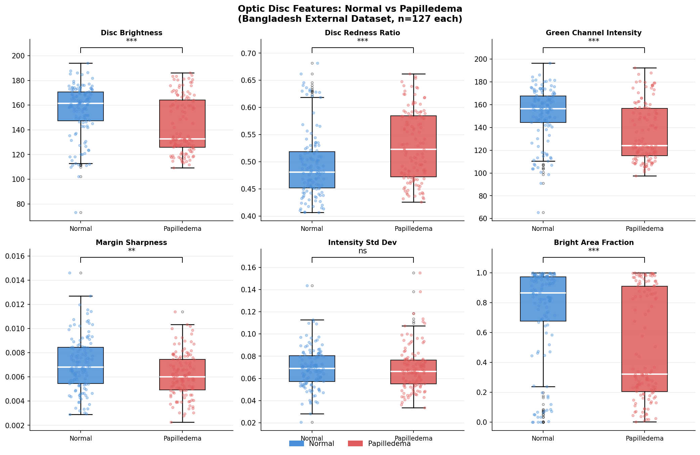
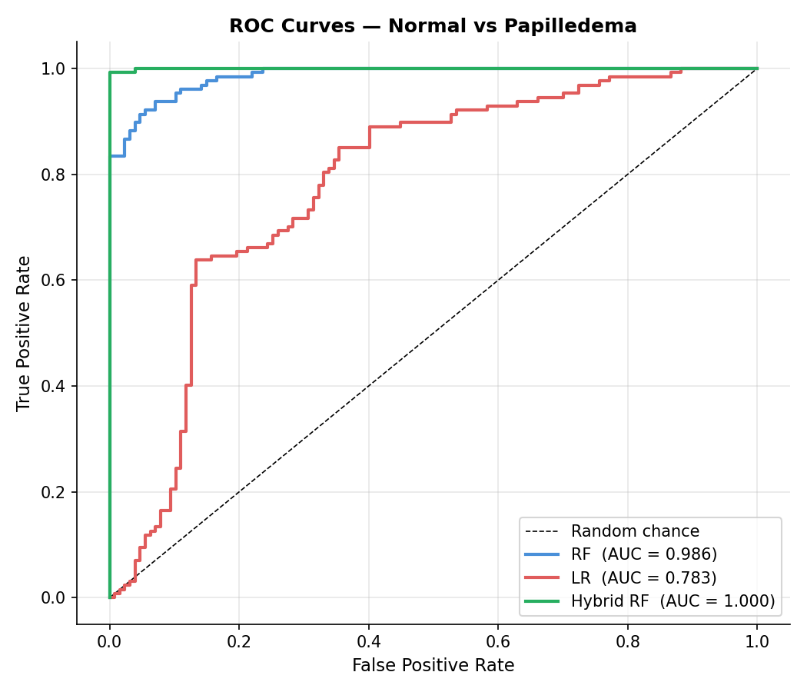
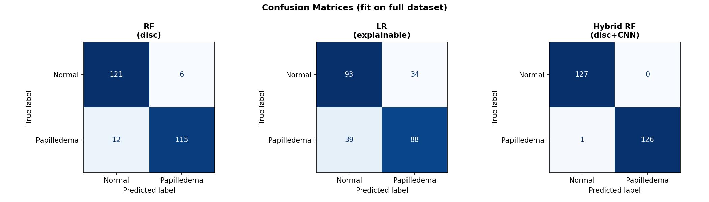
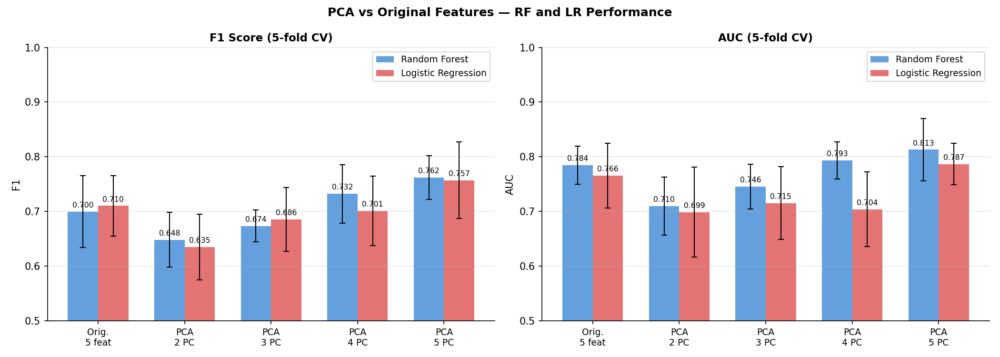

# Retinal Image Analysis for Neurological Disease Detection
### A Biomarker and Deep Learning Pipeline

**Ashmita Dutta · 2022B1A71372G · BITS Pilani, Goa Campus**  
*End-Semester Project — Prof. Vinayak Naik, Dept. of CSIS, April 2026*

---

## Overview

The retina shares embryological origin with the brain, making it a potential non-invasive window into neurological health. This project builds a full computational pipeline to extract quantitative vascular and structural biomarkers from retinal fundus images — motivated by the hypothesis that retinal changes can reflect neurodegeneration associated with Parkinson's disease.

Since no publicly labelled Parkinson's fundus dataset is available, the project uses **papilledema detection** as a proof-of-concept: papilledema involves optic disc changes driven by elevated intracranial pressure, and its disc-level biomarkers structurally overlap with those implicated in Parkinson's disease.

---

## Pipeline

```
Fundus Image → Preprocessing → Vessel Segmentation → Biomarker Extraction → Classification
                                                  ↘ Optic Disc Features → Classifier Comparison
```

The project proceeds in six phases:

| Phase | Description |
|-------|-------------|
| 1 | Retinal vessel segmentation (U-Net / LadderNet) on DRIVE, STARE, CHASE_DB1 |
| 2 | Vascular biomarker extraction: vessel density, tortuosity, fractal dimension |
| 3 | Papilledema CNN — EfficientNet-B0, 92% accuracy on Bangladesh clinical dataset |
| 4 | Optic disc feature engineering — 5/6 features significant at p < 0.001 |
| 5 | Classifier comparison: Random Forest, Logistic Regression, Hybrid RF |
| 6 | Multicollinearity analysis + PCA-based feature decorrelation |

---

## Results

### Vessel Segmentation — DRIVE Dataset

| Model | F1 | Sensitivity | Specificity | AUC |
|-------|----|-------------|-------------|-----|
| U-Net | 0.8169 | 0.7728 | **0.9826** | 0.9794 |
| LadderNet | **0.8219** | **0.7871** | 0.9813 | **0.9805** |

### Papilledema Detection — EfficientNet-B0

- **99%** accuracy on Kaggle training dataset  
- **92%** accuracy on external Bangladesh clinical dataset (n=254)  
- Grad-CAM confirms optic disc attention in **70% of test cases**

### Optic Disc Feature Analysis

5 of 6 disc features are statistically significant (Mann-Whitney U, p < 0.001) between Normal and Papilledema fundus images on the Bangladesh external dataset.



### Classifier Comparison — Normal vs Papilledema

| Model | F1 (CV) | AUC |
|-------|---------|-----|
| Random Forest (disc features) | 0.700 | 0.986 |
| Logistic Regression (explainable) | 0.710 | 0.783 |
| **Hybrid RF (disc + CNN score)** | **0.965** | **1.000** |





### After PCA Decorrelation

Multicollinearity within the disc feature set was suppressing Logistic Regression performance. After PCA:

| Model | F1 Before PCA | F1 After PCA |
|-------|--------------|--------------|
| Random Forest | 0.700 | 0.762 |
| Logistic Regression | 0.710 | 0.757 |



---

## Repository Structure

```
├── src/                        # U-Net / LadderNet model architecture
├── lib/                        # Preprocessing, patch extraction utilities
├── papilledema_cnn/            # EfficientNet-B0 CNN subproject
│   ├── scripts/
│   │   ├── train.py            # Model training
│   │   ├── train_eval.py       # Training with evaluation
│   │   ├── test_kaggle.py      # Evaluation on Kaggle dataset
│   │   ├── test_bangladesh.py  # Evaluation on Bangladesh dataset
│   │   ├── gradcam.py          # Grad-CAM interpretability
│   │   ├── split_kaggle.py     # Dataset splitting
│   │   └── prepare_bangladesh.py
│   ├── extract_cnn_scores.py   # Extract CNN confidence scores
│   ├── cnn_scores.csv          # Per-image CNN probabilities
│   └── gradcam_outputs/        # Grad-CAM visualizations
│
├── biomarkers.py               # Vessel density, tortuosity, fractal dimension
├── run_full_pipeline.py        # End-to-end inference + biomarker CSV export
├── bangladesh_biomarkers.py    # Biomarkers on Bangladesh dataset
├── discfeatures.py             # Optic disc feature extraction
├── classifier_comparison.py    # RF vs LR vs Hybrid classifier comparison
├── merge_features.py           # Merge disc features + CNN scores
├── multicollinearity_check.py  # Correlation and VIF analysis
├── pca_classifier.py           # PCA-based feature decorrelation
├── biomarker_boxplots.png      # Vascular biomarker distributions
├── disc_feature_boxplots.png   # Disc feature distributions
├── roc_comparison.png          # ROC curves for all classifiers
├── confusion_matrices.png      # Confusion matrices
├── feature_importance.png      # Random Forest feature importances
├── pca_scree.png               # PCA explained variance
├── pca_comparison.png          # Classifier performance before/after PCA
├── ASHMITA1372G_ENDSEMREPORT.pdf
├── configuration_drive.txt     # Training config — DRIVE
├── configuration_stare.txt     # Training config — STARE
├── configuration_chase.txt     # Training config — CHASE_DB1
├── run_training.py             # Train segmentation model
├── run_testing.py              # Evaluate segmentation model
└── run_keep_training.py        # Resume training from checkpoint
```

---

## Datasets Used

| Dataset | Images | Purpose |
|---------|--------|---------|
| DRIVE | 40 (768×584) | Segmentation training & evaluation |
| STARE | 20 (605×700) | Cross-dataset validation |
| CHASE_DB1 | 28 | Generalisation testing |
| Kaggle Papilledema | ~600 | CNN training |
| Bangladesh Clinical | 254 (127 Normal, 127 Papilledema) | External validation |

> Datasets are not included in this repository due to size and licensing. Model weights are also excluded.

---

## Dependencies

```bash
# Segmentation pipeline
pip install tensorflow keras numpy pillow opencv-python scikit-image h5py

# Biomarker + classification pipeline  
pip install pandas scikit-learn matplotlib scipy

# CNN (papilledema_cnn/)
pip install torch torchvision
```

---

## Acknowledgements

Vessel segmentation architecture based on  
[zhengyuan-liu/Retinal-Vessel-Segmentation](https://github.com/zhengyuan-liu/Retinal-Vessel-Segmentation) (MIT License) — U-Net/LadderNet implementation for retinal vessel segmentation.

All biomarker extraction, papilledema detection, optic disc feature engineering, and classifier code is original work.
